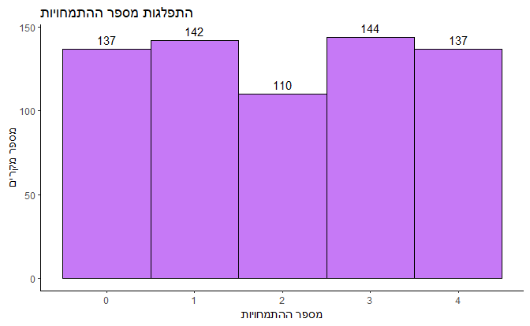
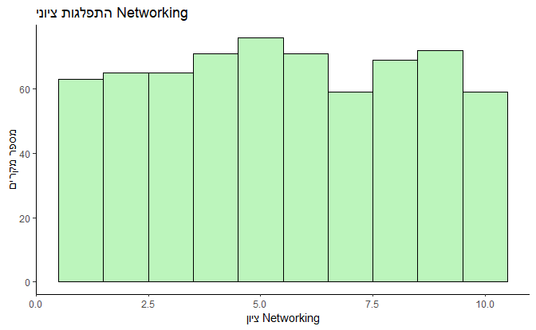
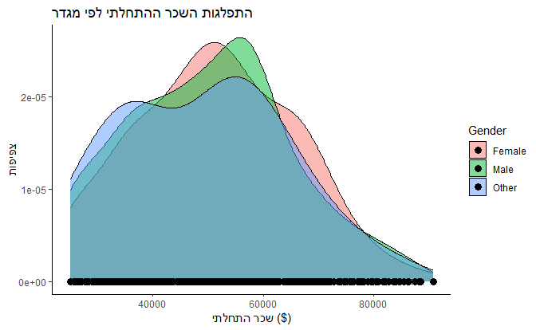
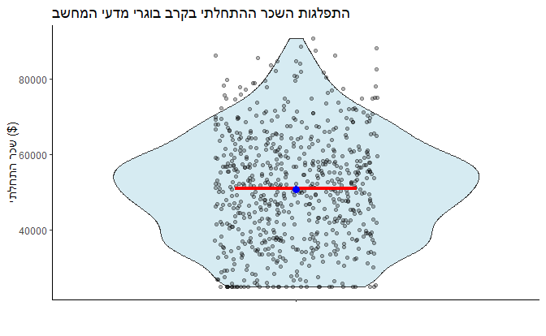
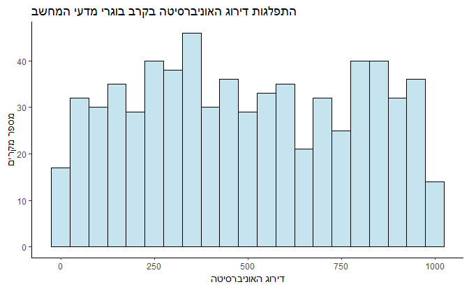
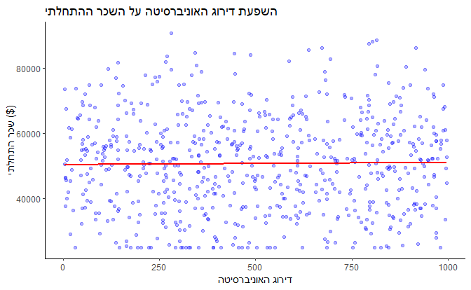
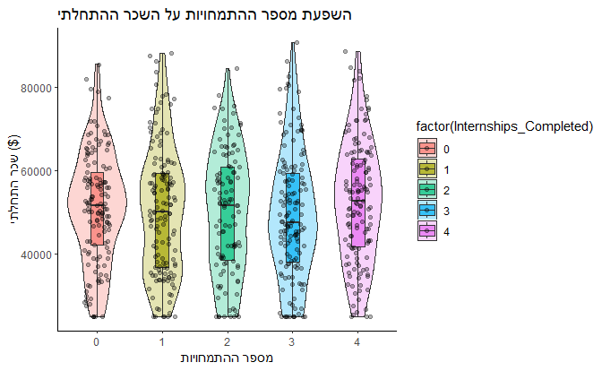
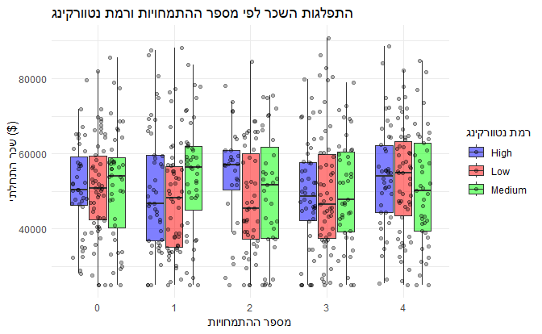
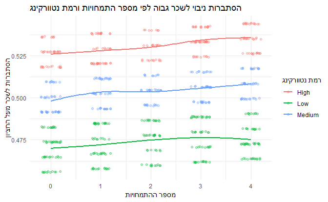
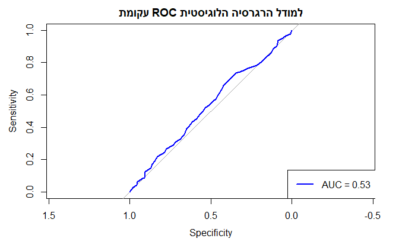

# 📊 פרויקט גמר – R למתחילים
### תהילה מן   
לניתוח המלא עם כל הנתונים והפרטים, עיינו **בקובץ המסכם:**  
➡ **[📂 פרויקט גמר – קובץ מסכם (PDF)](./Final_Report.pdf)**  

---

## 🎓 מבוא  
מחקר זה מתמקד בניתוח נתונים מתוך **"Education & Career Success"**, דאטאסט שנלקח מ-Kaggle, המכיל מידע על **5,000 בוגרים** מתחומים שונים.  
המחקר בודק את הקשרים בין משתנים אקדמיים ותעסוקתיים לבין רמות השכר ההתחלתי של **בוגרי מדעי המחשב בלבד**.  

---

## 🛠️ **שיטת המחקר**  

- **דאטאסט:** "Education & Career Success" מ-Kaggle.  
- **שפת תכנות:** `R`  
- **חבילות מרכזיות:** `ggplot2`, `dplyr`, `ggdist` `  
- **שיטות סטטיסטיות:**  
  - רגרסיה לינארית – לבדוק השפעה ישירה של המשתנים על השכר.  
  - רגרסיה לוגיסטית – לבדוק האם ניתן לנבא מי ירוויח מעל חציון השכר.  

---

📊 **גרפים מתוך החקירה הראשונית:**  
  
  
  
  
  
  
  

---

## 📈 **ממצאים עיקריים**  

- 🔹 **לא נמצא קשר מובהק** בין מספר ההתמחויות לבין השכר ההתחלתי.  
- 🔹 **לא נמצא קשר מובהק** בין כישורי הנטוורקינג לבין השכר ההתחלתי.  
- 🔹 **המודלים הסטטיסטיים אינם מנבאים היטב את רמות השכר** –  
  - **רגרסיה לינארית** → מסבירה **0.16% בלבד מהשונות בשכר (R² = 0.0016)**.  
  - **רגרסיה לוגיסטית** → יכולת הניבוי **נמוכה מאוד (AUC = 0.53, קרוב לניחוש אקראי)**.    

---

## 📈 המחשות גרפיות  

### **התפלגות השכר לפי מספר התמחויות ורמת נטוורקינג**  
  

### **ניבוי שכר גבוה לפי מספר התמחויות וכישורי נטוורקינג**  
  

### **עקומת ROC להערכת איכות המודל הלוגיסטי**  
  

 **מסקנה:** המודלים אינם מספקים ניבוי חזק של השכר בהתבסס על משתנים אלו בלבד.  

## 📌 **סיכום ומסקנות**  

- **מספר ההתמחויות וכישורי הנטוורקינג אינם מסבירים את השונות בשכר**  
- **למרות שהתמחויות ונטוורקינג חשובים לקריירה, הנתונים אינם מראים קשר ישיר לשכר ההתחלתי.**  
- **מחקרי המשך יכולים לשלב נתונים נוספים** כדי לקבל תמונה רחבה ומדויקת יותר.  
